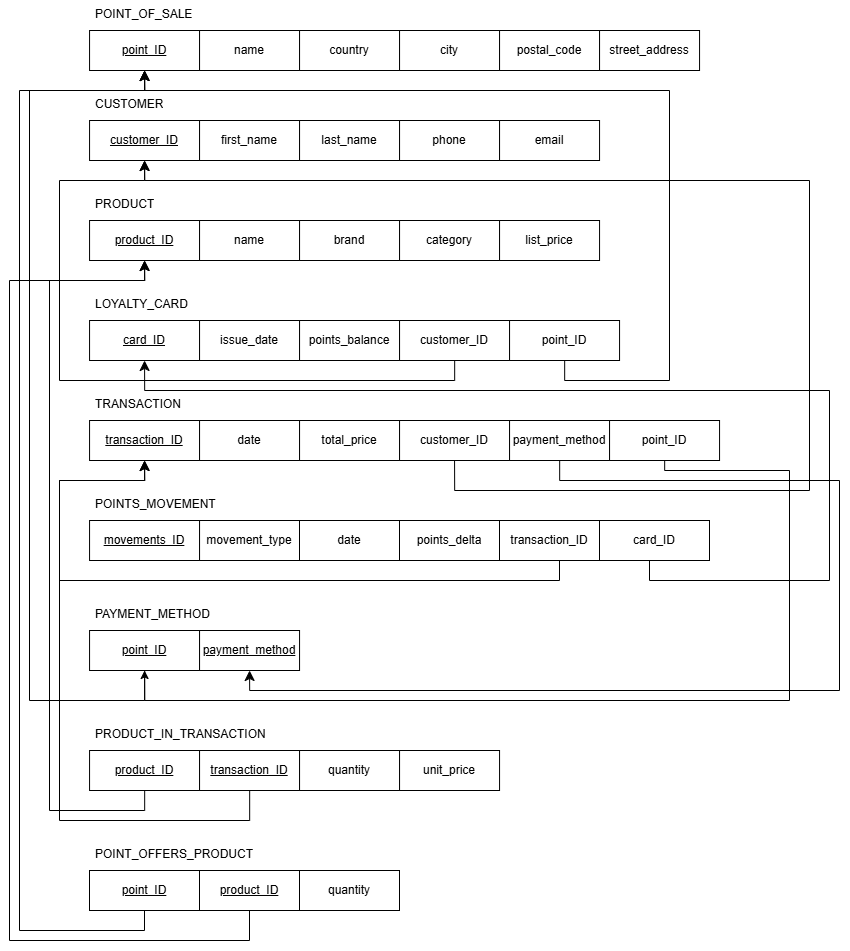
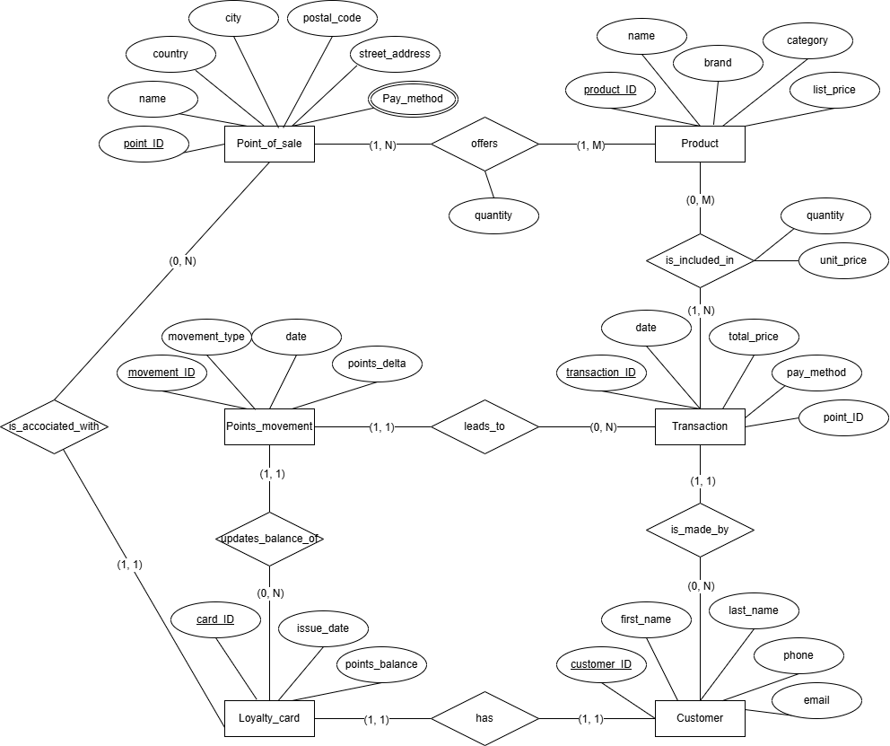

# Supermarket Chain — Relational Database (MySQL)

**Course:** Databases · USI Lugano (M.Sc. Economics) · 2025–26  
**Author:** Anastasiia Rekovets  
**Engine:** MySQL 8.0

---

## Overview

Design and implementation of a fully normalized relational database for a multi-country supermarket chain. The system models customers, transactions, products, store inventory, payment methods, and a loyalty points program — enforcing referential integrity throughout.

---

## Repository Structure

```
supermarket-chain-db/
├── creating_tables.sql     # Schema creation + sample data (clean, runnable)
├── queries.sql             # 15 analytical SQL queries
├── project_Rekovets.sql    # Full MySQL Workbench dump (schema + data)
└── README.md
```

---

## Schema — 8 Tables (3NF)

| Table | Description |
|---|---|
| `POINT_OF_SALE` | Physical store locations (Lugano, Milan, Munich) |
| `CUSTOMER` | Customer master data |
| `PRODUCT` | Product catalog with shared list prices |
| `LOYALTY_CARD` | One card per customer — 1:1 enforced via `UNIQUE(customer_id)` |
| `PAYMENT_METHOD` | Accepted payment methods per store (composite PK) |
| `TRANSACTION` | Purchase records linked to customer, store, and payment method |
| `PRODUCT_IN_TRANSACTION` | Line items resolving the many-to-many between transactions and products |
| `POINTS_MOVEMENT` | Individual loyalty point earn/redeem events (full audit trail) |

### Relational Schema


```
POINT_OF_SALE(point_id, name, country, city, postal_code, street_address)

CUSTOMER(customer_id, first_name, last_name, phone, email)

PRODUCT(product_id, name, brand, category, list_price)

LOYALTY_CARD(card_id, issue_date, points_balance,
             customer_id FK→CUSTOMER,          -- UNIQUE: enforces 1:1
             point_id    FK→POINT_OF_SALE)

PAYMENT_METHOD(point_id FK→POINT_OF_SALE, payment_method)  -- composite PK

TRANSACTION(transaction_id, date, total_price,
            customer_id     FK→CUSTOMER,
            point_id        FK→POINT_OF_SALE,
            payment_method  FK→PAYMENT_METHOD(point_id, payment_method))

PRODUCT_IN_TRANSACTION(product_id     FK→PRODUCT,       -- composite PK
                       transaction_id FK→TRANSACTION,
                       quantity, unit_price)

POINT_OFFERS_PRODUCT(point_id   FK→POINT_OF_SALE,       -- composite PK
                     product_id FK→PRODUCT,
                     quantity)

POINTS_MOVEMENT(movements_id, movement_type, date, points_delta,
                transaction_id FK→TRANSACTION (nullable),
                card_id        FK→LOYALTY_CARD)
```

---

## Key Design Decisions

**Historical pricing** — `unit_price` is stored in `PRODUCT_IN_TRANSACTION` at transaction time, independent of `list_price` in `PRODUCT`. Past receipts remain correct even when prices change.

**Loyalty points as movements** — Points are modeled as individual delta events (`EARN` / `REDEEM`) rather than a single balance, enabling full auditability and preventing update anomalies.

**Store-scoped payment methods** — `PAYMENT_METHOD` is per store; transactions reference a valid `(point_id, payment_method)` composite FK to enforce consistency.

**1:1 customer–card relationship** — Enforced via `UNIQUE(customer_id)` on `LOYALTY_CARD`, not just application logic.

**3NF normalization** — No transitive dependencies; all many-to-many relationships resolved via junction tables (`PRODUCT_IN_TRANSACTION`, `POINT_OFFERS_PRODUCT`).

**Performance indexes** — Three covering indexes added:
- `idx_tr_customer_date` on `TRANSACTION(customer_id, date)`
- `idx_pit_transaction` on `PRODUCT_IN_TRANSACTION(transaction_id)`
- `idx_pm_card_date` on `POINTS_MOVEMENT(card_id, date)`

---

## ER Diagram

```
POINT_OF_SALE ──(1,N)──< PAYMENT_METHOD
      │ (1,N)
      ├──────────────────< TRANSACTION (0,N) >── PRODUCT_IN_TRANSACTION (1,M) >── PRODUCT
      │                         │ (0,N)                                                │
      │                   POINTS_MOVEMENT                              POINT_OFFERS_PRODUCT
      │ (0,N)                                                                      (1,N) │
LOYALTY_CARD (1,1) ──── CUSTOMER                                                        │
      │ (0,N)                                                          POINT_OF_SALE ───╯
      ╰── POINTS_MOVEMENT
```

Full EER and relational schema diagrams are in the project report.

---

## SQL Queries (`queries.sql`)

15 queries covering joins, aggregations, nested subqueries, and relational division:

| # | Query | Technique |
|---|---|---|
| Q1 | Customers with loyalty cards and registered store | 2-way JOIN |
| Q2 | All transactions with customer details | JOIN |
| Q3 | Transaction total consistency check (stored vs recomputed) | JOIN + GROUP BY |
| Q4 | Top-5 best-selling products by units sold | JOIN + GROUP BY + LIMIT |
| Q5 | Revenue by product category | JOIN + GROUP BY |
| Q6 | Loyalty cards with above-average points balance | Scalar subquery |
| Q7 | Products never sold | NOT IN subquery |
| Q8 | Customers who purchased a specific product | 2-level nested subquery |
| Q9 | Basket size per transaction (distinct items + total units) | JOIN + GROUP BY |
| Q10 | Most recent transaction per customer | Correlated subquery (MAX) |
| Q11 | Net loyalty points earned/redeemed per customer | 3-way JOIN + SUM |
| Q12 | Customers with no transactions | NOT EXISTS |
| Q13 | Product stock per store | 3-way JOIN |
| Q14 | Stores accepting every payment method in the system | Double NOT EXISTS (relational division) |
| Q15 | High-value customers (spend above average) | HAVING + nested subquery |

---

## Sample Data

| Entity | Count |
|---|---|
| Stores | 3 (Lugano, Milan, Munich) |
| Customers | 5 |
| Products | 6 |
| Transactions | 6 |
| Line items | 14 |
| Points movements | 6 (5 EARN + 1 REDEEM) |

---

## How to Run

```bash
# Option 1 — clean setup (recommended)
mysql -u root -p < creating_tables.sql   # creates schema + inserts sample data
mysql -u root -p supermarket_chain < queries.sql  # runs all 15 queries

# Option 2 — full Workbench dump
mysql -u root -p < project_Rekovets.sql
```

Tested on **MySQL 8.0.44**.

---

## Skills Demonstrated

- Relational database design (EER diagram → relational schema)
- Third Normal Form (3NF) normalization
- Referential integrity: PKs, FKs, composite keys, UNIQUE constraints, CHECK constraints
- Complex SQL: multi-level nested subqueries, correlated subqueries, relational division (double NOT EXISTS)
- Transaction-level historical pricing
- Loyalty program modeling with full audit trail
